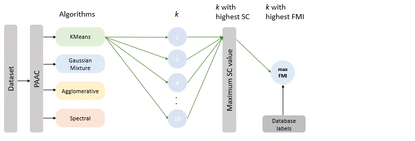

# Pipeline for Clustering Analysis of Protein Sequences

This repository contains a comprehensive pipeline for clustering protein sequences using various clustering algorithms. The pipeline includes data preprocessing, feature extraction, clustering, and evaluation of clustering performance. This pipeline helps in understanding the suitability of clustering methods for the functional annotation of proteins.

## Overview


## Introduction
Protein sequence clustering is a crucial task in bioinformatics, enabling the identification of protein families and functional annotation. This pipeline leverages multiple clustering algorithms to provide robust and accurate clustering of protein sequences. Using this pipeline, users can cluster protein families based on their shared functions.

## Dataset
- **Lysozyme CGCh Dataset**: Contains fasta files of Lysozyme C, Lysozyme G, and Lysozyme Ch protein families.
- **Labels**: Lysozyme C, Lysozyme G, and Lysozyme Ch.
- **Source**: The accession number of datasets can be obtained from [CAZy](https://www.cazy.org/Glycoside-Hydrolases.html) and corresponding sequence are obtained from [Batch Entrez](https://www.ncbi.nlm.nih.gov/sites/batchentrez).
> **Note:** Lysozyme CGCh was taken as an example to demonstrate the pipeline.

## Preprocessing
- **Elimination of Non-standard Amino Acids**: Eliminates sequences containing non-standard amino acids (UZOBJX).
- **Duplicate Removal**: Removes duplicate sequences within and between protein families based on accession number.
- **Non-standard Amino Acid Elimination**: Eliminates sequences containing non-standard amino acids (UZOBJX).
- **Optional Outlier Removal**: Removes outliers based on sequence length.
- **Optional Length Filtering**: Filters sequences below a specified length threshold.
> **Note:** [CD-HIT](https://www.bioinformatics.org/cd-hit/) was used to remove redundant sequences.

## Feature Extraction
Feature extraction is crucial for clustering as it transforms raw protein sequences into numerical representations that capture essential biochemical properties, facilitating the differentiation and grouping of similar sequences.
- **Pseudo Amino Acid Composition (PAAC)**: Extracts features based on physicochemical properties of amino acids.
- **Physicochemical Properties Considered**:
    - Hydrophobicity
    - Hydrophilicity
    - Mass
## Clustering Analysis
Implements multiple clustering algorithms:
- **KMeans**: Partitions data into k clusters by minimizing the variance within each cluster.
- **Agglomerative Clustering**: Hierarchical clustering method that builds nested clusters by merging or splitting them successively.
- **Gaussian Mixture**: Probabilistic model that assumes all data points are generated from a mixture of several Gaussian distributions.
- **Spectral Clustering**: Uses the eigenvalues of a similarity matrix to perform dimensionality reduction before clustering in fewer dimensions.
- **Affinity Propagation**: Clustering algorithm based on the concept of "message passing" between data points.
- **DBSCAN**: Density-based clustering algorithm that groups together points that are closely packed together.
- **OPTICS**: Similar to DBSCAN but can identify clusters of varying densities.
- **Mean-shift**: Clustering algorithm that seeks modes or high-density regions in the feature space.
- **BIRCH**: Hierarchical clustering algorithm that builds a tree structure for clustering large datasets.


## Evaluation Metrics
### Intrinsic Metrics
- **Silhouette Coefficient (SC)**: Measures how similar an object is to its own cluster compared to other clusters.
- **Calinski-Harabasz Index (CH)**: Evaluates the ratio of the sum of between-clusters dispersion and of within-cluster dispersion.
- **Davies-Bouldin Index (DB)**: Represents the average similarity ratio of each cluster with its most similar cluster.

### Extrinsic Metrics
- **Fowlkes-Mallows Index (FMI)**: Assesses the similarity between true clusters and predicted clusters.
- **F1 Score**: Harmonic mean of precision and recall, used for binary classification.
- **Matthews Correlation Coefficient (MCC)**: Measures the quality of binary classifications.
- **Adjusted Mutual Information (AMI)**: Adjusted measure of the agreement between true and predicted clusters.
- **Contingency Matrix**: A table used to describe the performance of a classification model.

## Installation
To run this pipeline, you need Python 3.8+.

1. **Clone the repository:**
```bash
git clone https://github.com/RakeshBusi/Clustering.git
```
2. **Navigate to the repository directory:**
```bash
cd Clustering
```
3. **Install the required packages:**
```bash
pip install -r requirements.txt
```

## Glossary
- **PAAC**: Pseudo Amino Acid Composition
- **k**: Number of clusters
- **SC**: Silhouette Coefficient
- **FMI**: Fowlkes-Mallows Index

## Usage

1. **Run the Jupyter Notebook:**
```bash
jupyter notebook Clustering_pipeline.ipynb
```
1. **Follow the steps in the notebook** to preprocess data, apply clustering algorithms, and evaluate results.

2. **Sample Dataset** is present in the Lysozyme_CGCh folder, demonstrating the clustering pipeline using the Lysozyme CGCh dataset.
