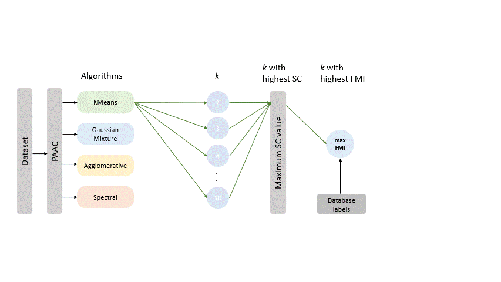

# Pipeline for Clustering Analysis of Protein Sequences

This repository contains a comprehensive pipeline for clustering protein sequences using various clustering algorithms. The pipeline includes data preprocessing, feature extraction, clustering, and evaluation of clustering performance.

## Overview


## Introduction
Protein sequence clustering is a crucial task in bioinformatics, enabling the identification of protein families and functional annotation. This pipeline leverages multiple clustering algorithms to provide robust and accurate clustering of protein sequences.

## Dataset
- **Lysozyme CGCh Dataset**: Contains fasta files of Lysozyme C, Lysozyme G, and Lysozyme Ch protein families.
- **Labels**: Lysozyme C, Lysozyme G, and Lysozyme Ch.

## Preprocessing
- **Duplicate Removal**: Removes duplicate sequences within and between protein families.
- **Non-standard Amino Acid Elimination**: Eliminates sequences containing non-standard amino acids (UZOBJX).
- **Optional Outlier Removal**: Removes outliers based on sequence length.
- **Optional Length Filtering**: Filters sequences below a specified length threshold.

## Feature Extraction
- **Pseudo Amino Acid Composition (PAAC)**: Extracts features based on physicochemical properties of amino acids.
- **Physicochemical Properties Considered**:
    - Hydrophobicity
    - Hydrophilicity
    - Mass

## Clustering Analysis
Implements multiple clustering algorithms:
- KMeans
- Agglomerative Clustering
- Gaussian Mixture
- Spectral Clustering
- Affinity Propagation
- DBSCAN
- OPTICS
- Mean-shift
- BIRCH

## Evaluation Metrics
### Intrinsic Metrics
- **Silhouette Coefficient (SC)**
- **Calinski-Harabasz Index (CH)**
- **Davies-Bouldin Index (DB)**

### Extrinsic Metrics
- **Fowlkes-Mallows Index (FMI)**
- **F1 Score**
- **Matthews Correlation Coefficient (MCC)**
- **Adjusted Mutual Information (AMI)**
- **Contingency Matrix**

## Installation
To run this pipeline, you need Python 3.8+ and the following packages:
- numpy
- pandas
- scikit-learn
- matplotlib

## Usage
1. **Clone the repository:**
```bash
git clone https://github.com/RakeshBusi/Clustering.git
```
2. **Run the Jupyter Notebook:**
```bash
jupyter notebook Clustering_pipeline.ipynb
```
3. **Follow the steps in the notebook** to preprocess data, apply clustering algorithms, and evaluate results.

4. **Sample Dataset** is present in the Lysozyme_CGCh folder, demonstrating the clustering pipeline using the Lysozyme CGCh dataset.
